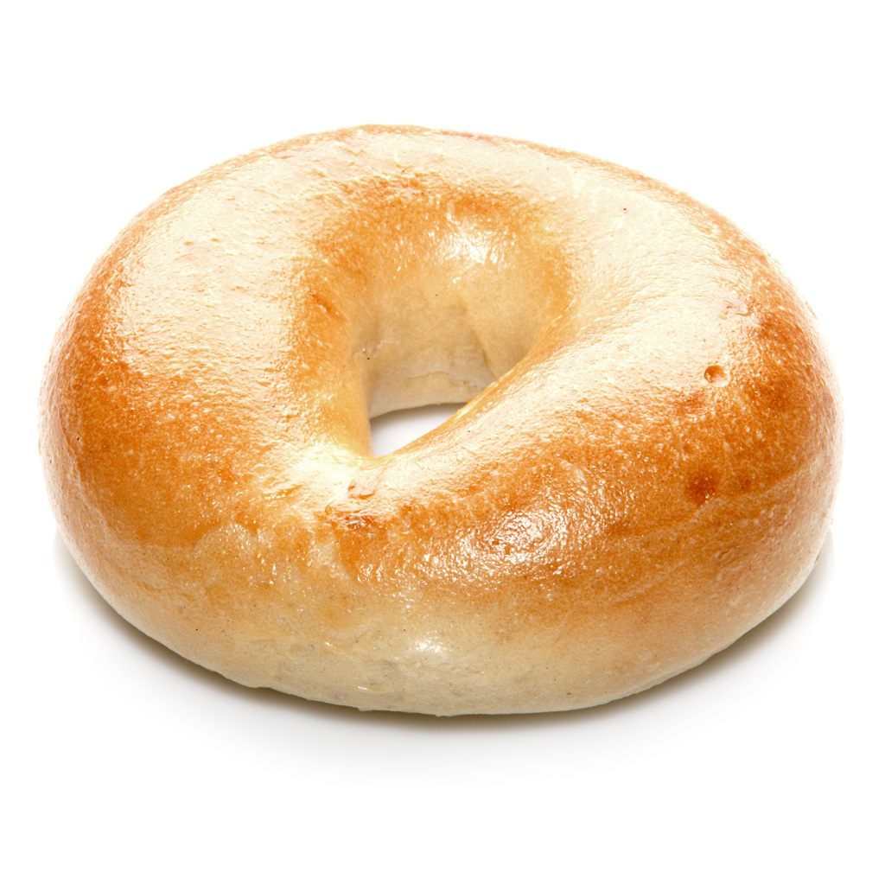

# [Crypto] Low Sodium Bagel - 300
```
I brought you a bagel, see if you can find the secret ingredient.

by balex
```

bruh lets open up this bagel, i am hungry. i didn't eat breakfast yet!



....

uuuhhhh
its a bagel.... lets strings this?

```
JFIF
$3br
%&'()*456789:CDEFGHIJSTUVWXYZcdefghijstuvwxyz
	#3R
&'()*56789:CDEFGHIJSTUVWXYZcdefghijstuvwxyz
Ppnb
i_Pz
"]RkC*$
c9a#)r
sMfub
_3eu
/P9?
a<M8n
uZzE%
e<f"1
ho^E
v0%:
.&vPw{
aR.7
xVc"
ra7}T
```

OK OK OK OK i am not going to find anything here maybe steg  hide has something for me? idk usually jpegs have things in them?

```
"low-sodium-bagel.jpeg":
  format: jpeg
  capacity: 17.6 KB
Try to get information about embedded data ? (y/n) y
Enter passphrase:
  embedded file "steganopayload4837.txt":
    size: 37.0 Byte
    encrypted: rijndael-128, cbc
    compressed: yes
```

uhhhmmmm is this good? i don't use steghide......
PS ***there is no passphrase***

uuuuhhhhhh ok lets see what is in here

oh hello steganopayload4837.txt

***FLAG***
```
utflag{b1u3b3rry_b4g3ls_4r3_th3_b3st}
  ```
