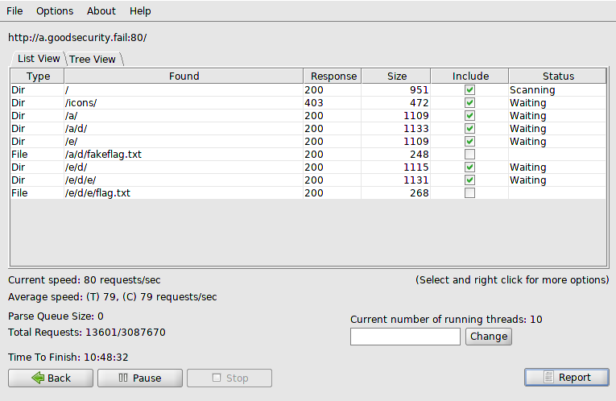

# HabbyDabby's Secret  - 650
```
HabbyDabby's hidden some stuff away on his web server that he created and wrote from scratch on his Mac. See if you can find out what he's hidden and where he's hidden it!

http://a.goodsecurity.fail/
```
So let me start off with, i solved it but i ca't give you a picture of the website or how it looks. basically it is just a website. but there was nothing to actually find on the webpage itself. So i looked at the description and finding it, that there was a file that you had to find * because i think the webpage had a hidden text box and which told us which language we want it in * So i assumed that there was some file i needed to find. and i looked up how to find files in a server. i used DirBuster!!!! and when i launched DirBuster this is what i found


booyah! flag.txt
opened that puppy up and we get
FLAG
```
utflag{mac_os_hidden_files_are_stupid}```
